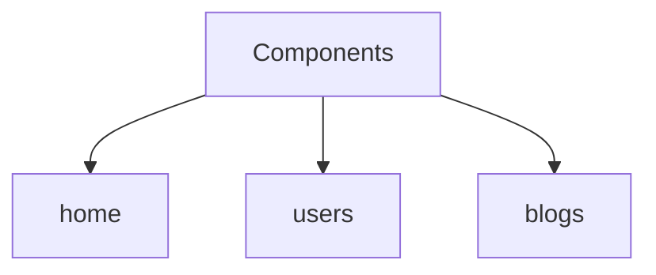

# Sample Project - Blog Website

- This blog website consists of 3 components:
  - home: handles the blog website home page requests
  - users: handles user related requests
  - blogs: handles blog CRUD operations

- One to many relationship is established between users and blogs.
- User will be redirected to a custom created 404 error page if wrong route is requested.

# Features

- User needs to have user account to create blogs.
- User can see other users blogs with/without login.
- User can modify his/her blogs.
- User can modify his/her account details.

*Note - This project is created to learn and practice Flask concept and is a part of Udemy course [Python and Flask Bootcamp: Create Websites using Flask! - Udemy](https://www.udemy.com/course/python-and-flask-bootcamp-create-websites-using-flask/)*